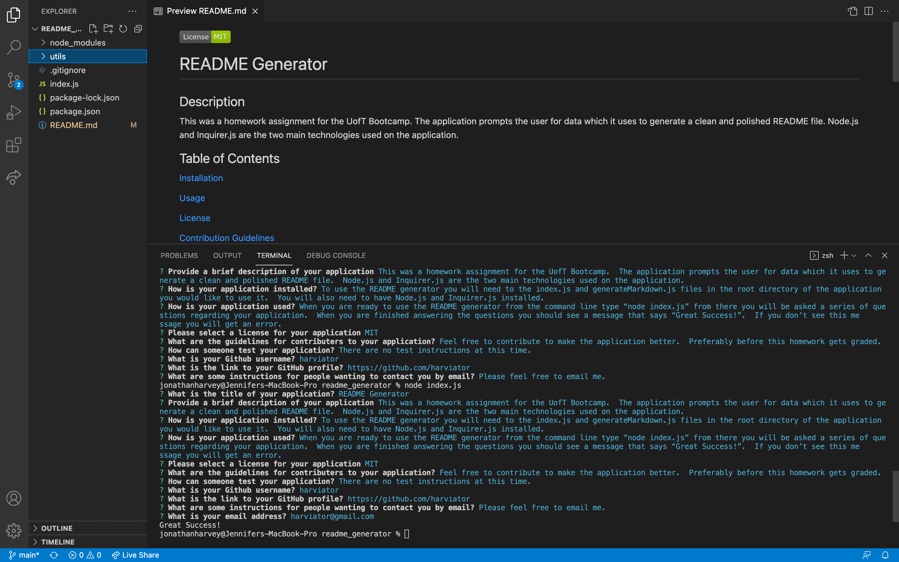

  # README Generator

  ## Description 
  This was a homework assignment for the UofT Bootcamp.  The application prompts the user for data which it uses to generate a clean and polished README file.  Node.js and Inquirer.js are the two main technologies used on the application.

  ## Table of Contents
  
 [Installation](#installation)
  
 [Usage](#usage)
  
 [License](#license)
  
 [Contribution Guidelines](#contribution-guidelines)
  
 [Test Instructions](#test-instructions)
  
 [Questions](#questions)

  ## Installation
  To use the README generator you will need to the index.js and generateMarkdown.js files in the root directory of the application you would like to use it.  You will also need to have Node.js and Inquirer.js installed.

  ## Usage
  When you are ready to use the README generator from the command line type “node index.js” from there you will be asked a series of questions regarding your application.  When you are finished answering the questions you should see a message that says “Great Success!”.  If you don’t see this message you will get an error.

  ## License
  The license for this project is [MIT License](https://choosealicense.com/licenses/mit/)

  ## Contribution Guidelines
  Feel free to contribute to make the application better.  Preferably before this homework gets graded.

  ## Test Instructions
  There are no test instructions at this time.

  ## Screen Shot
  

  ## Questions
  Please feel free to email me.

  harviator@gmail.com
  
  GitHub Profile: https://github.com/harviator

  GitHub Username: harviator
